# FLVM V1 APP
## Fast Learning Video Maker

This repository, developed by Stefan Pietrusky, describes the prototype FLVM. FLVM is a Flask-based web application for quickly creating educational videos. In the browser interface, the user first selects a language model backend (e.g., Ollama, OpenAI, or Gemini) and enters a topic. Alternatively, they can upload their own script as a text file. If desired, the app automatically generates a script from the topic, divides it into sentences, and converts each sentence into a voice recording using EdgeTTS. A video clip is then created for each sentence, optionally with a colored background or image, and with subtitles displayed if required. An intro/outro, background music, transitions, and technical parameters such as resolution, codec, frame rate, and voice selection can be customized.

As soon as the generation process starts, the app creates a job, saves the necessary assets, assembles the clips, adds transitions and music, and encodes the result with MoviePy/FFmpeg. Meanwhile, the interface continuously displays the progress and an approximate processing time. Once the job is complete, the finished video is immediately available for download. The app thus combines text generation, speech synthesis, and video composition into a continuous workflow, from topic to exported learning video.

> **⚠️ Work in Progress:** This prototyp is currently under active development. While I make it available for research purposes, please be aware that there will be some changes to the functional structure. I recognize that some current technical design decisions may not be optimal and are subject to revision. Researchers using this prototyp should expect potential updates and changes. I recommend checking back regularly for updates and versioning information.


## FLVM Structure
The structure of the current [V1] FLVM app is shown below.


## Interface of the FLVM app


## Installing and running the application 
1. Clone this repository on your local computer: 
```bash 
git clone https://github.com/stefanpietrusky/flvm.git
```
2. Install the required dependencies:
```bash 
pip install -r requirements.txt
```
3. Install [Ollama](https://ollama.com/) and load a model for example [gemma3](https://ollama.com/library/gemma3) (4B) or another.
4. Install [FFmpeg](https://ffmpeg.org/), a tool to record, convert and stream audio and video. Set the environment variable in PATH.
5. Install [ImageMagick](https://imagemagick.org/), a tool for editing and manipulating digital images. The reference to the application must be adjusted in the code (os.environ["IMAGEMAGICK_BINARY"] =)
6. Start the app with:
```bash 
python app.py
```
